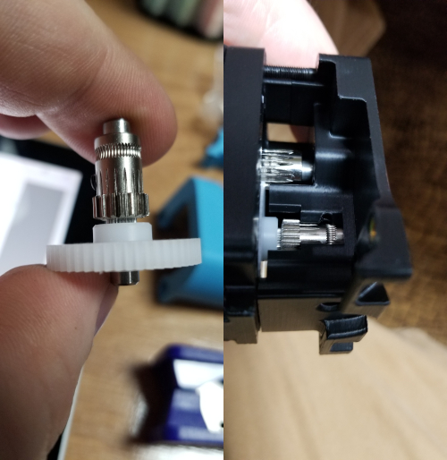
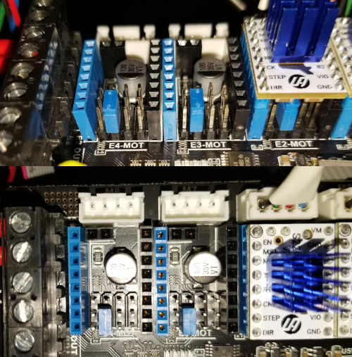
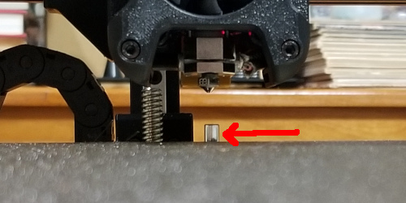

# Voron Trident R1

[Assembly Guide](https://raw.githubusercontent.com/VoronDesign/Voron-Trident/main/Manual/Assembly_Manual_Trident.pdf)

## Table of Contents

- [Voron Trident R1](#voron-trident-r1)
  - [Table of Contents](#table-of-contents)
  - [Fysetc Kit Review & Thoughts](#fysetc-kit-review--thoughts)
    - [Expect to self-source](#expect-to-self-source)
    - [Missing components](#missing-components)
    - [Defective parts](#defective-parts)
    - [Part selection & quality](#part-selection--quality)
      - [Linear Rails](#linear-rails)
      - [Wiring Harness](#wiring-harness)
  - [Community Mods](#community-mods)

## Fysetc Kit Review & Thoughts
### Expect to self-source
Be aware that the Fysetc kit doesn't come with thread locker or lube which you
will need to self-source.  The BOM from the Fysetc kit is [here][Fysetc BOM].

[Fysetc BOM]: https://github.com/FYSETC/FYSETC-Voron-Trident/blob/c7aa8a3367e8e34acbb511fb117d201eb7b6c6d8/BOM.md

### Missing components
In my kit, the following were missing (and specifically called out in the
official BOM):
* 3x Wago 221-412 (2-connector)
* 3x Wago 221-415 (5-connector)

### Defective parts
* Extruder gear / shaft gear wasn't positioned correctly on shaft to allow it
to fit correctly with other parts.  I was able to correct this in my arbor press
but I shouldn't have had to.

    

* Stepper driver mounting header was off-axis in such a way that a driver
couldn't be installed without modification.

    

* BOM calls for a 5x30mm shaft for the Z probe.  My kit seems to have come with
a 5x35mm shaft.

    

### Part selection & quality

#### Linear Rails

It's a massive pain to grease the linear rails.  I found the most effective way
was to slide the carriage a little past the end so that 3 or 4 balls were
exposed, use a syringe with a distribution / blunt needle, and squirt grease
onto the balls.  I'd slide the carriage back on, rub it around, then repeat the
process a number of times.  It would have been much simpler if the kit had come
with rails that had a grease port.  This would be a significant upgrade to the
kit.

#### Wiring Harness

The supplied wiring harness didn't make any sense and frequently seemed to be
intended to be used in a way that conflicted with the assembly guide.  It would
be a lot nicer if the harness matched what the Voron team was expecting people
to do.  Or at least, just provide spools of uncut wire and the crimps needed to
follow the BOM.

## Community Mods

* [Wago Mounts for Bed, Extended to 5](https://github.com/VoronDesign/VoronUsers/tree/master/printer_mods/Boingomw/Wago_mount)
* [Adjusted Spool Holder Location](https://github.com/VoronDesign/VoronUsers/tree/master/printer_mods/elcrni/V2.4-Trident-Spool-Holders)
* [Logitech C270 Mount](https://github.com/VoronDesign/VoronUsers/tree/master/printer_mods/Fiction/C270_mount)
* [Various Wago mounts](https://github.com/VoronDesign/VoronUsers/tree/master/printer_mods/LoganFraser/WagoMounts)
* [Electronics-Access Rockers](https://github.com/VoronDesign/VoronUsers/tree/master/printer_mods/RockNLol/RockNRoll)
* Exhaust management
    * [Activated Charcoal + HEPA](https://github.com/VoronDesign/VoronUsers/tree/master/printer_mods/KevinAkaSam/VEFACH)
    * [HEPA Exhaust Filter](https://github.com/VoronDesign/VoronUsers/tree/master/printer_mods/dePrintinator/HEPA_Filter_Exhaust)
